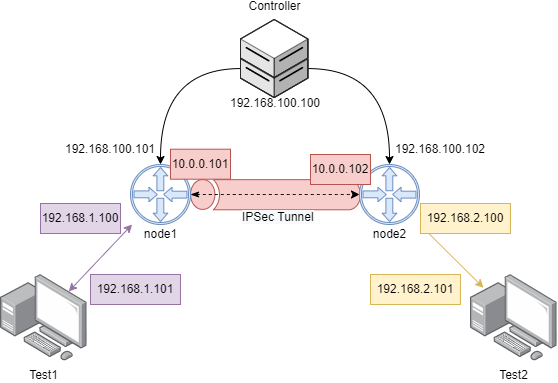

# Escenario
 
* **Controlador**: se encarga de configurar los dos agentes. Para eso el controlador necesita saber las ips de control de los agentes, las redes que van a interconectar (192.168.1.0/24,192.169.2.0/24), y las ips entre las que van a crear el tunel (10.0.0.101,10.0.0.102).
* **Node1, Node2**: los nodos o agentes tienen instalado todas las librerias relacionadas con sysrepo, netopeer e ipsec. Se configurarán a través de netconf, usando el modelo yang del [draft-ietf-i2nsf-sdn-ipsec-flow-protection-03](https://datatracker.ietf.org/doc/html/draft-ietf-i2nsf-sdn-ipsec-flow-protection-03).
* **Test1, Test2**: Son los contenedores para probar la conectividad. 

# Como ejecutarlo:

Para poder ejecutarlo necesitas tener docker-compose instalarlo en una vm, y que la vm soporte IPsec (que el kernel tenga compilado la parte de xfrm). Con solo ejecutar lo siguiente en el mismo directorio:
```bash
sudo docker-compose up
# Si quieres ejecutarlo en el background
sudo docker-compose up -d
```
Va a tardar un rato la primera vez porque tiene que compilar las imágenes. 

## Configuracion de los agentes:
Para configurar los agnetes hay que ejecutar lo siguiente:
```bash
sudo docker exec -it i2nsf_controller curl -X 'POST' \
  'http://localhost:5000/i2nsf' \
  -H 'accept: application/json' \
  -H 'Content-Type: application/json' \
  -d '{
  "encAlg": [
    "des"
  ],
  "hardLifetime": 60,
  "intAlg": [
    "hmac-sha1-160"
  ],
  "softLifetime": 30,
  "nodes": [
    {
      "ipControl": "192.168.100.101",
      "ipData": "10.0.0.101",
      "networkInternal": "192.168.1.0/24"
    },
    {
      "ipControl": "192.168.100.102",
      "ipData": "10.0.0.102",
      "networkInternal": "192.168.2.0/24"
    }
  ]
}'
```

### Formato del JSON
* **encAlg**: Algoritmo usado por el tunel para encriptar. De momento solo soporta:
    * des
    * 3des
* **intAlg**: Algoritmo usado por el tunel para comprobar la integridad de los paquetes. Solo soporta:
    * hmac-md5-96
    * hmac-md5-128
    * hmac-sha1-96
    * hmac-sha1-160
* **softLifeTime**: Tiempo para inicializar el proceso de rekey.
* **hardLifeTime**: Tiempo en el que si no se ha realizado el rekey tira el enlace ipsec. 
* **Nodes**: Información de los nodos con lo siguiente:

    * **ipControl**: IP que tiene en la red de control
    * **ipData**: IP con la que le va a ver el otro agente y la que va a usar para levantar el tunel.
    * **networkInternal**: la red que va a conectar a través del tunel ese agente (a la que esta conectada).

## Comprobacion del tunel:
Por defecto las dos máquinas `test1` y `test2` tienen como ruta por defecto los agentes. Puedes probar la conectividad:
* Desde `test1`:
```bash
sudo docker exec -it test1 ping 192.168.2.101
```
* Desde `test2`:
```bash
sudo docker exec -it test2 ping 192.168.1.101
```